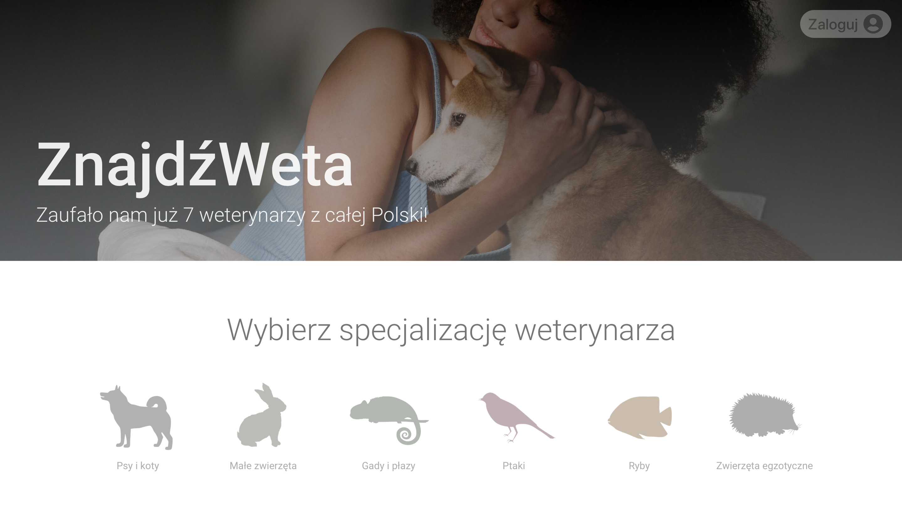
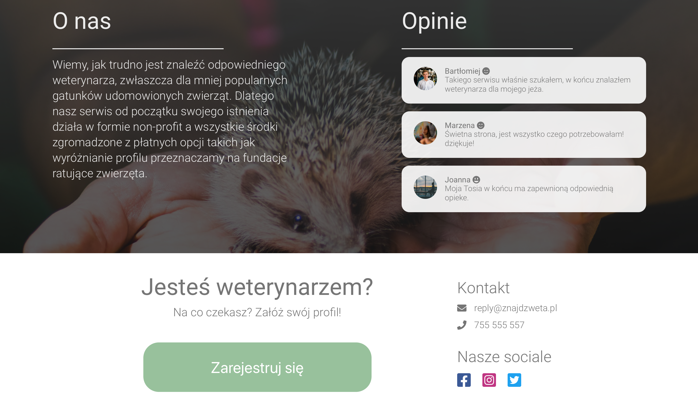
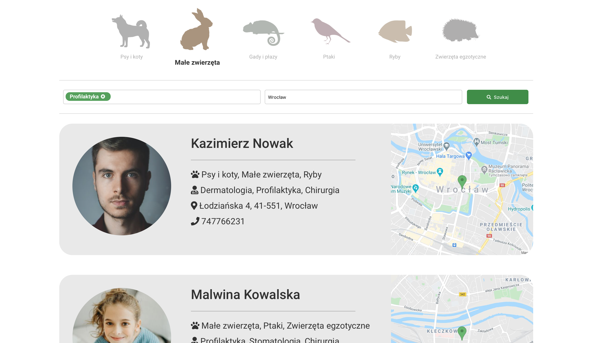

# ZnajdzWeta v1.2.0
Aplikacja webowa napisana w ReactJs służąca do szukania weterynarzy z całej polski.

## Aktualnie zaimplementowane funkcje
 - Możliwość założenia konta oraz wysłanie prośby o utworzenie profilu weterynarza i udostępnienie go w wyszukwiarce.
 - Możliwość zmiany hasła oraz jego przypomnienie drogą mailową.
 - Możliwość zmiany adresu e-mail oraz jego przypomienie drogą mailową.
 - W pełni responsywna strona - telefony, tablety, komputery i tv.
 - Wyszukiwarka zwracająca wyniki zapytania na podstawie filtrów takich jak - Specjalizacja / Kategoria / Miasto
 - Baza danych użytkowników i ich profili FireBase.

## Demo strony z przykładowymi kontami (lokalizacja Wrocław): https://znajdzweta.netlify.app

## Zdjęcia strony:

This project was bootstrapped with [Create React App](https://github.com/facebook/create-react-app).
